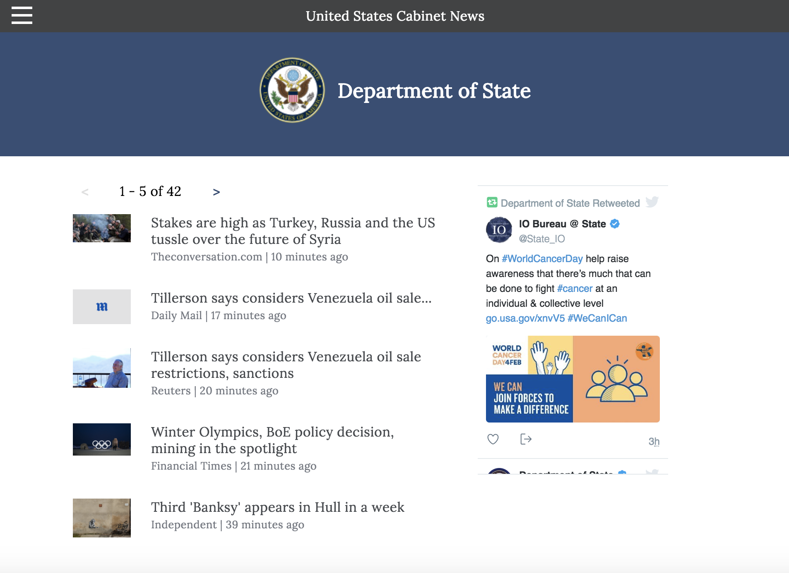

Cabinet News Site
-----------------

Summary

This app enables the user to see news articles for all of the departments in the United States executive branch. In order to get the cabinet news at a quick glance, the user can get the sentiment and a summary of the article without actually going to the news article. This app also places the departments twitter timeline alongside the news articles so the user can see the opinions of the department in their own words.

This site uses html, css, jQuery, and node.